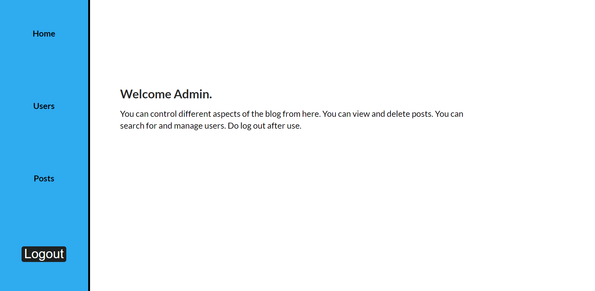

# turing

This is a simple CRUD application using React and Firebase. A blog with both user and admin functions. 
 It included simple CRUD operations and helped strengthen my understanding of React.
What new things did I implement?
- Used Context API to manage global state variables.
- Authentication using Context API and Protected Routes.
- Delete confirmation using Modals.
- Form validation with and without React-hook-form.
 
What more features do I need to add?
- Edit blog post functionality.
- Change/forgot password.
- Give admin the privilege to promote users as admins.
- Integrate Firebase Admin SDK. 

 
 

